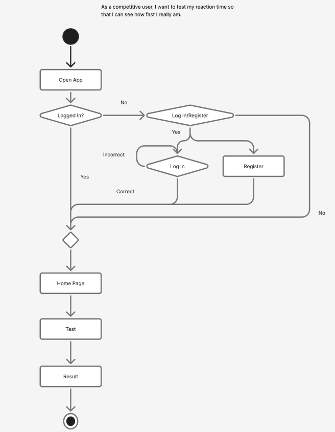

# Reaction Time Testing App

## Team members

Minho Eune ([Github Profile](https://github.com/minhoeune))

Yash Pazhianur ([Github Profile](https://github.com/yashpaz123))

Edward Ye ([Github Profile](https://github.com/EdwarddYe))

Ani Guduru([Github Profile](https://github.com/AniGuduru))

## Stakeholders

Primary Target User: Socially active, competitive smartphone users aged 16-30 who enjoy games and challenges. These users frequently use social media, enjoy competition and social recognition. Some users also use this app to cinsistently train and test their reaction time in order to improve in competetive online gaming and other reaction-based sports.

Stakeholder name: Alex  

Age: 23  

Occupation: Recent College Graduate  

Relevant Traits: Competitive, active on social media, plays console and mobile games, enjoys challenging friends

### Stakeholder Goals/Needs

1. Wants to test his reaction speed.

2. Wants to compare his reaction speed with his friends.

3. Wants a reliable way to accurately test his reaction speed

4. Would like to improve reaction and clicking speed.

5. Would like analytics on his reaction speed to understand his overall performance over a large sample size of tests. These include avg. time, top times, and general improvement. 

6. Wants recognition for being the "fastest".

7. Wants fun activity to share on social media/group chats.

### Stakeholder Problems/Frustrations

1. Existing reaction time apps don't really connect to his network of friends smoothly.

2. Scores kind of feel meaningless without direct comparison with someone he knows.

3. Many online tests are convoluted and require set-up for what is ultimately a simple test.

4. Some tests are inaccurate and its methods can test dexterity instead of reaction speed.

5. Many tests dont save previous data and rovivide no meaningful help for the user to improve their long term reaction time goals. 

## Product Vision Statement

Our app helps people accurately measure and improve their reaction time, while competing with their friends and the world through socially-driven challenges that make it enjoyable and engaging. It also provides analytics of individual user performance and ranks times across a global leaderboard and time distribution.

## User Requirements

1. As a competitive user, I want to test my reaction time so that I can see how fast I really am.

    Estimation of effort: M

    Acceptance criteria:

        - The user can start a reaction test
    
        - The test waits a random amount of time before signaling.
    
        - The user's tap is recorded only after the signal appears.

2. As a social user, I want to compare my score with my friends so that I know how good I am relative to my friends.

    Estimation of effort: M

    Acceptance criteria:
    
         - The app shows a friends leaderboard
    
         - The user can see their ranking in the list
    
         - Friends are sorted by reaction time (fastest to slowest)
    
         - The leaderboard updates when new scores are recorded.

         - The analytics show average time for reaction, ecxluding any major outliers that could be caused by user not paying attention to the screen signal.

   

4. As a new user, I want to see how my reaction time compares to the global average so that my score is meaningful.

    Estimation of effort: M

    Acceptance criteria:
    
        - The global average reaction time is displayed.
    
        - The user's reaction time is shown alongside the average.
    
        - A message explains what percentile the user belongs in.
    
        - Global average is recalculated as more results are recorded.

        - Results are shown on a distribution curve with user's time being ranked as a percentile of global average reaction times.

6. As a competitive user, I want to challenge my friend so that we can compete directly.

    Estimation of effort: M

    Acceptance criteria:
    
        - The user can select a friend to challenge.
    
        - The friend recieves a notification from the app, or an invitation via message.

        - The user and a friend can run a series of games and reach a verdict on who is faster on average.

8. As a competitive user, I want a leaderboard so that I can see top performers and strive to improve.

    Estimation of effort: M

    Acceptance criteria:
    
        - The leaderboard displays ranked users
    
        - Users are sorted by fastest reaction time
    
        - The leaderboard supports global and friends view
    
        - The leaderboard updates when rankings change

9. As a user, I want fair rankings so that cheating or unfair device advantages (bots) don't ruin competition.

    Estimation of effort: L

    Acceptance criteria:
    
        - The app detects unusually fast times (less than 100ms as unassisted human reaction time is generally accepted to be between 100ms and 120ms)
    
        - Suspicious results are excluded from leaderboards and total data

        - Leaderboards truncate times that are outliers and only present valid reaction times determined by acceptance criteria. 

11. As a social user, I want to share my results on social media so that I can show off my performance.

    Estimation of effort: S

    Acceptance criteria:
    
        - The user can tap a share button after a test
    
        - The shared result includes the reaction time score

12. As a casual user, I want to be able to test my reaction speed fast and easily.

    Estimation of effort: S

    Acceptance criteria:
    
        - The app loads fast
    
        - The instructions and the test itself is short and clear
    
        - Results are shown immediately
    
        - Test can be done without signing in, but results won't be recorded as your own

13. As a competitive user, I want to see my performance over time so that I can track my improvement.

    Estimation of effort: M

    Acceptance criteria:
    
        - The app stores past reaction time results
    
        - A visual history (chart/list) is displayed
    
        - The user can see average and best scores
    
        - Older results can be seen

14. As a competitive user, I want to see my global ranking so that competition feels personal.

    Estimation of effort: M

    Acceptance criteria:
    
        - The user's global rank/percentile is displayed clearly
    
        - The user's rank updates when their best score is updated

## Activity Diagrams

### UML Diagram: Reaction Time Test

### UML Diagram: Friends Leaderboard

## Clickable Prototype

[Prototype](https://www.figma.com/proto/CLjukQ0ZcWb91f3FE6unik/Coyotes---Wireframe?node-id=20-2&p=f&t=fYSgNZsz0LyTtocf-1&scaling=scale-down&content-scaling=fixed&page-id=0%3A1&starting-point-node-id=20%3A2&show-proto-sidebar=1)
